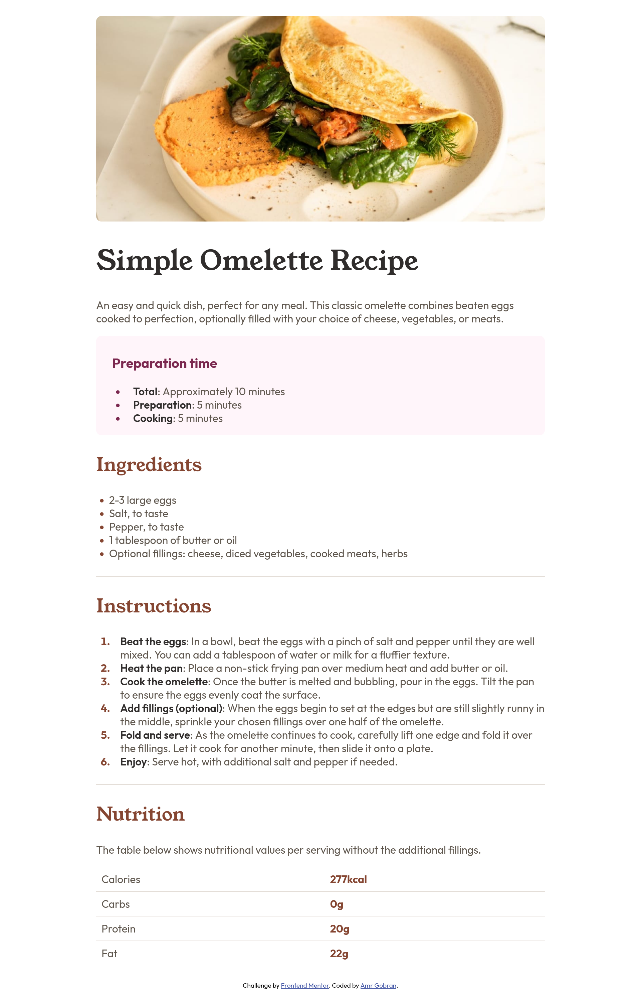

# Frontend Mentor - Recipe Page Solution

This is a solution to the [Recipe page challenge on Frontend Mentor](https://www.frontendmentor.io/challenges/recipe-page-KiTsR8QQKm).

## Table of contents

- [Frontend Mentor - Recipe Page Solution](#frontend-mentor---recipe-page-solution)
  - [Table of contents](#table-of-contents)
  - [Overview](#overview)
    - [screenshot](#screenshot)
    - [Links](#links)
  - [My process](#my-process)
    - [Built with](#built-with)
    - [What I Learned](#what-i-learned)
    - [Continued development](#continued-development)
    - [Useful resources](#useful-resources)
  - [Author](#author)

## Overview 

### screenshot



### Links 

- Solution URL: [solution URL here]()
- Live site URL: [live site URL here]()

## My process

### Built with 

- Semantic HTML5 markup
- CSS custom properties
- Mobile-first workflow

### What I Learned 

I learned how to style unordered lists `ul` and ordered lists `ol` and HTML tables `table` with CSS.

Example:

``` css
ul {
  list-style-position: inside;
}
```

### Continued development

I want to continue focusing on building more frontend projects, and learn JavaScript.

### Useful resources

- [developer.mozilla.org list-style](https://developer.mozilla.org/en-US/docs/Web/CSS/list-style) This helped me for list styling.
- [developer.mozilla.org styling_tables](https://developer.mozilla.org/en-US/docs/Learn/CSS/Building_blocks/Styling_tables)

## Author

- Website - [My github](https://www.github.com/AmrGobran)
- Frontend Mentor - [@AmrGobran](https://www.frontendmentor.io/profile/AmrGobran)
- Twitter - [@GobranAmr](https://www.x.com/GobranAmr)